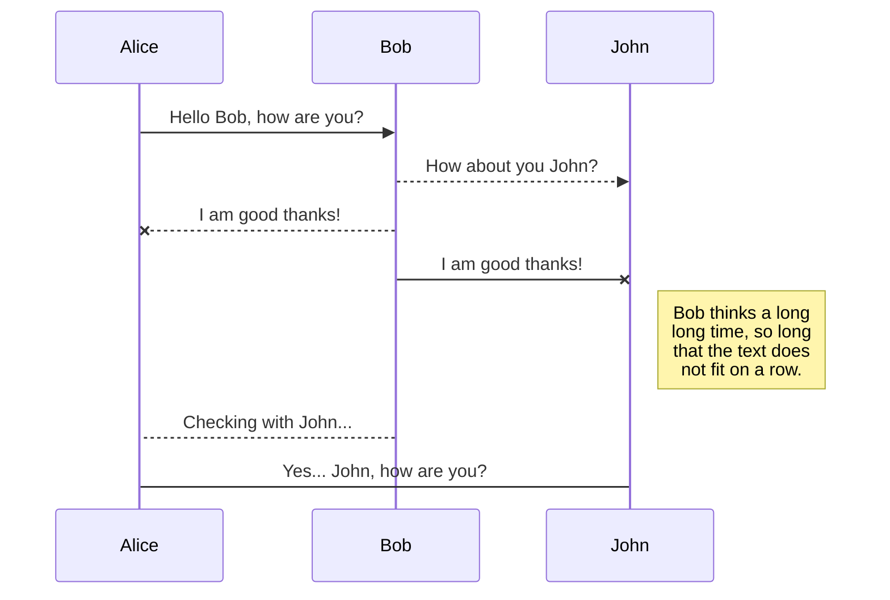
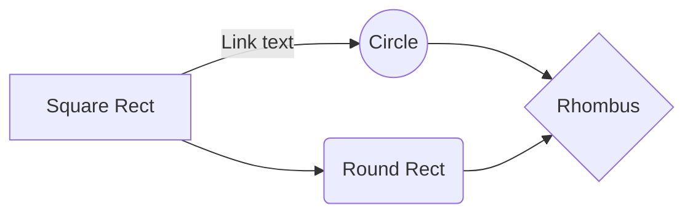

# Git & commandes pratiques
Petite page sympa pour se rappeler des commandes les plus utilisées dans les bonnes pratiques de Git ! 

## git init

permet d'initialiser le suivi de version avec Git d'un projet.

## git status
permet de connaitre l'état/le status du dossier local git.
ex : sur quelle branche on se trouve, si on est à jour avec la branche master, s'il y a des choses à commit, etc.

## git add FICHIER

permet d'ajouter un fichier à l'index (stage) pour que les modifications de ce fichier soient prises en compte dans le prochain commit.

## git commit 

permet de réaliser un commit avec les dernières modifications indexées.
```bash
-m <MESSAGE> 
```
==> permet de spécifier un message lors du commit
```bash
-a
```
==> permet d'ajouter tous les fichiers (déjà suivis) sans passer par un add

## git config

permet de configurer les informations utilisées par le dépôt git.
```bash
--global
```
==> configuration pour tous les projets

```bash
--local
```
==> configuration pour le dossier courant uniquement
```bash
--system
```
==> configuration niveau machine

Les options principales : user.name, user.email

## git log

permet de consulter l'historique des commit du dossier git.

```bash
-N
```
==> afficher les N derniers commit

## git checkout

permet de récupérer la dernière version d'un élément du dépôt git.

``` bash
git checkout <fichier>
```
⇒ dernier version du fichier

``` bash
git checkout -- <fichier>
```
⇒ dernier version indexée du fichier
``` bash
git checkout <branche>
```
⇒ déplacement sur la branche 

Marche aussi avec les versions (TAG).

## git fetch

permet de visualiser les changements
```bash
git fetch <REMOTE>
```

## fichier .gitignore

Ce fichier permet de spécifier l'ensemble des fichiers (ou type de fichier) qui ne seront jamais indexés et de les ignorer.

*.a.          : pas de fichier .a dans tous le projet
!lib.a.      : suivi du fichier malgré la règle précédente
/TODO  : ignorer le fichier TODO à la racine du projet
build/     : ignorer tous les fichiers dans le répertoire build
doc/*.txt   : ignorer doc/notes.txt, mais pas doc/server/arch.txt
doc/**/*.txt : ignorer tous les fichiers .txt sous le répertoire doc/


Synchronization is one of the biggest features of StackEdit. It enables you to synchronize any file in your workspace with other files stored in your **Google Drive**, your **Dropbox** and your **GitHub** accounts. This allows you to keep writing on other devices, collaborate with people you share the file with, integrate easily into your workflow... The synchronization mechanism takes place every minute in the background, downloading, merging, and uploading file modifications.

There are two types of synchronization and they can complement each other:

- The workspace synchronization will sync all your files, folders and settings automatically. This will allow you to fetch your workspace on any other device.
	> To start syncing your workspace, just sign in with Google in the menu.

- The file synchronization will keep one file of the workspace synced with one or multiple files in **Google Drive**, **Dropbox** or **GitHub**.
	> Before starting to sync files, you must link an account in the **Synchronize** sub-menu.

## Open a file

You can open a file from **Google Drive**, **Dropbox** or **GitHub** by opening the **Synchronize** sub-menu and clicking **Open from**. Once opened in the workspace, any modification in the file will be automatically synced.

## Save a file

You can save any file of the workspace to **Google Drive**, **Dropbox** or **GitHub** by opening the **Synchronize** sub-menu and clicking **Save on**. Even if a file in the workspace is already synced, you can save it to another location. StackEdit can sync one file with multiple locations and accounts.

## Synchronize a file

Once your file is linked to a synchronized location, StackEdit will periodically synchronize it by downloading/uploading any modification. A merge will be performed if necessary and conflicts will be resolved.

If you just have modified your file and you want to force syncing, click the **Synchronize now** button in the navigation bar.

> **Note:** The **Synchronize now** button is disabled if you have no file to synchronize.

## Manage file synchronization

Since one file can be synced with multiple locations, you can list and manage synchronized locations by clicking **File synchronization** in the **Synchronize** sub-menu. This allows you to list and remove synchronized locations that are linked to your file.


# Publication

Publishing in StackEdit makes it simple for you to publish online your files. Once you're happy with a file, you can publish it to different hosting platforms like **Blogger**, **Dropbox**, **Gist**, **GitHub**, **Google Drive**, **WordPress** and **Zendesk**. With [Handlebars templates](http://handlebarsjs.com/), you have full control over what you export.

> Before starting to publish, you must link an account in the **Publish** sub-menu.

## Publish a File

You can publish your file by opening the **Publish** sub-menu and by clicking **Publish to**. For some locations, you can choose between the following formats:

- Markdown: publish the Markdown text on a website that can interpret it (**GitHub** for instance),
- HTML: publish the file converted to HTML via a Handlebars template (on a blog for example).

## Update a publication

After publishing, StackEdit keeps your file linked to that publication which makes it easy for you to re-publish it. Once you have modified your file and you want to update your publication, click on the **Publish now** button in the navigation bar.

> **Note:** The **Publish now** button is disabled if your file has not been published yet.

## Manage file publication

Since one file can be published to multiple locations, you can list and manage publish locations by clicking **File publication** in the **Publish** sub-menu. This allows you to list and remove publication locations that are linked to your file.


# Markdown extensions

StackEdit extends the standard Markdown syntax by adding extra **Markdown extensions**, providing you with some nice features.

> **ProTip:** You can disable any **Markdown extension** in the **File properties** dialog.


## SmartyPants

SmartyPants converts ASCII punctuation characters into "smart" typographic punctuation HTML entities. For example:

|                |ASCII                          |HTML                         |
|----------------|-------------------------------|-----------------------------|
|Single backticks|`'Isn't this fun?'`            |'Isn't this fun?'            |
|Quotes          |`"Isn't this fun?"`            |"Isn't this fun?"            |
|Dashes          |`-- is en-dash, --- is em-dash`|-- is en-dash, --- is em-dash|


## UML diagrams

You can render UML diagrams using [Mermaid](https://mermaidjs.github.io/). For example, this will produce a sequence diagram:



And this will produce a flow chart:

